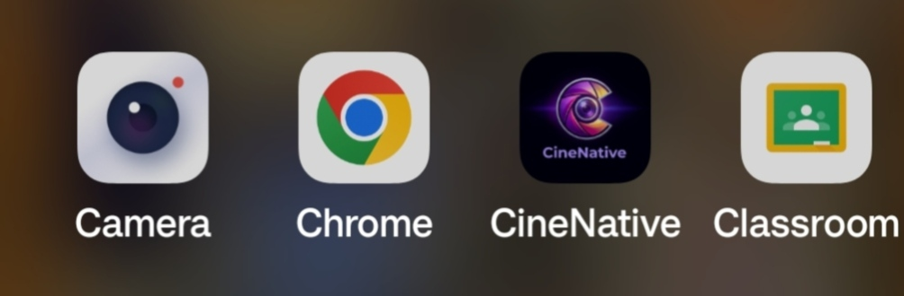
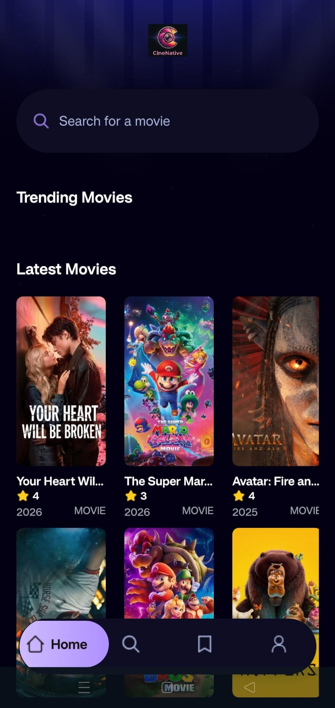
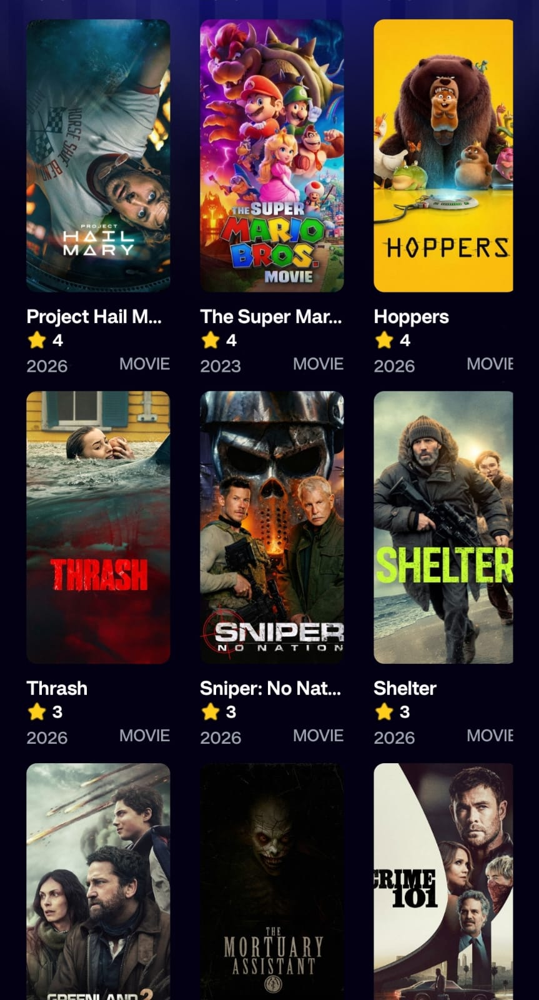
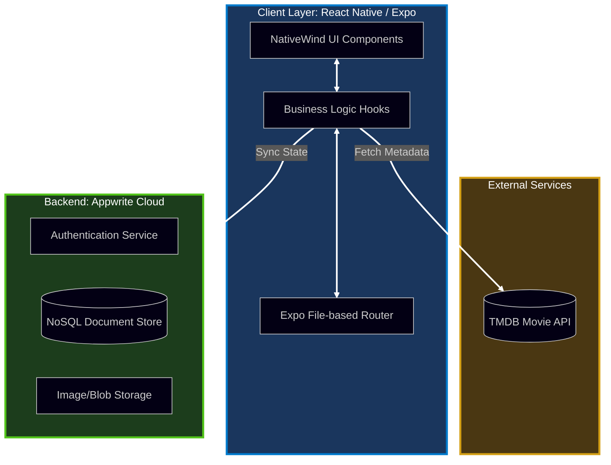
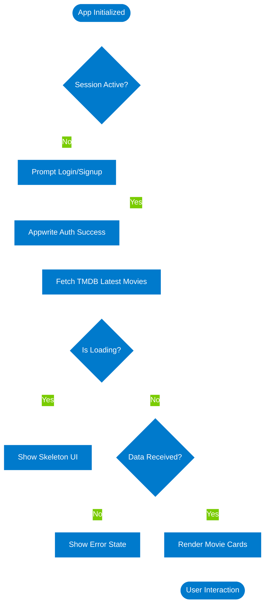
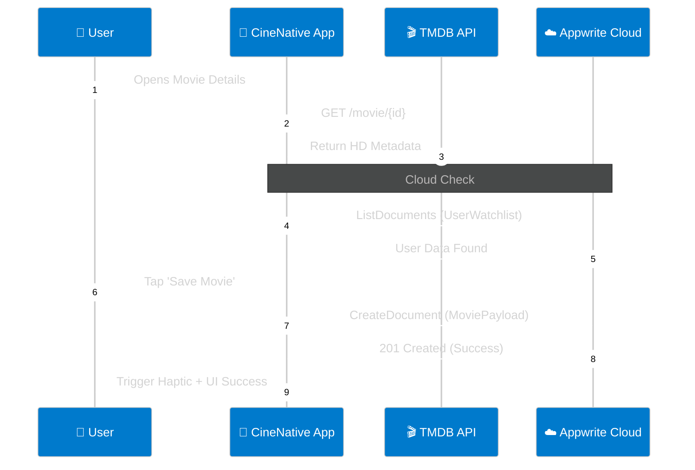
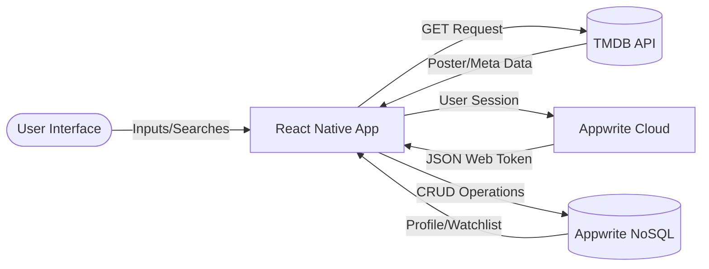

# 🎬 CineNative

**A Cinematic Movie Discovery & Personalization App** _Built with React Native, Expo, Appwrite, and TMDB API._

[](https://expo.dev/accounts/salonyy/projects/CineNative/builds/1f85f246-febf-4e37-89b3-51328a6fe666)
[](https://expo.dev/accounts/salonyy/projects/CineNative/builds/1f85f246-febf-4e37-89b3-51328a6fe666)
[](#project-architecture)
[](#key-features)

---

## 📱 Visual Experience

<div align="center">
  <table style="width:100%; text-align:center;">
    <tr>
      <td width="50%">
        <p align="center"><b>🎬 Discover Movies</b></p>
        
      </td>
      <td width="50%">
        <p align="center"><b>🔍 Smart Search</b></p>
        
      </td>
    </tr>
    <tr>
      <td width="50%">
        <p align="center"><b>⭐ Personal Watchlist</b></p>
        
      </td>
    </tr>
  </table>

  <br />
  <i>"CineNative leverages high-resolution imagery from TMDB with smooth, native transitions for a premium viewing experience."</i>
</div>
---

## 🏗 Project Architecture

CineNative follows a modular **Atomic Design Pattern** combined with a **Serverless Backend-as-a-Service (BaaS)** architecture.
Here is the high-level system design for CineNative:



---

## ⚙️ App Logic & State Flow



---

## 🔄 Data Interaction Model



---

## 📊 Data Flow Diagram (DFD)

How data moves between the client and the cloud.



---

## 🛠️ Tech Stack & Ecosystem

CineNative is built using a modern, serverless mobile stack designed for scalability and high-performance UI rendering.

### 🧩 Core Infrastructure Diagram

This diagram illustrates how the core technologies interact within the system lifecycle.

```mermaid
%%{init: {'theme': 'dark', 'themeVariables': { 'lineColor': '#61DAFB', 'mainBkg': '#030014', 'nodeTextColor': '#FFFFFF' }}}%%
graph LR
    subgraph UI_UX [Frontend Framework]
        A[React Native] --- B[Expo SDK 51]
        B --- C[NativeWind UI]
    end

    subgraph LOGIC [State & Routing]
        D[Expo Router] --- E[React Hooks]
    end

    subgraph BACKEND [Backend as a Service]
        F[Appwrite Auth] --- G[Appwrite NoSQL]
    end

    subgraph DATA [External Data]
        H[TMDB API 3.0]
    end

    %% Connections
    UI_UX ==> LOGIC
    LOGIC ==> BACKEND
    LOGIC ==> DATA

    %% Styling
    style UI_UX fill:#1a1a1a,stroke:#61DAFB,stroke-width:2px
    style BACKEND fill:#1a1a1a,stroke:#FD366E,stroke-width:2px
    style DATA fill:#1a1a1a,stroke:#01B4E4,stroke-width:2px
```



## 🛠️ Technical Breakdown

| Layer           | Technology              | Usage                                    |
| :-------------- | :---------------------- | :--------------------------------------- |
| **Framework**   | **React Native (Expo)** | Cross-platform mobile architecture.      |
| **Navigation**  | **Expo Router**         | Type-safe, file-based routing.           |
| **Styling**     | **NativeWind**          | Utility-first CSS for mobile (Tailwind). |
| **Backend**     | **Appwrite Cloud**      | Managed Auth, NoSQL DB, and Storage.     |
| **Data Source** | **TMDB API**            | Real-time global movie metadata.         |
| **Build Tool**  | **EAS Build**           | Cloud-based Android APK compilation.     |

---

## 📦 Installation & Setup

Follow these steps to set up the development environment and run CineNative on your local machine or physical device.

### 📋 Prerequisites

- **Node.js 20+** (LTS recommended)
- **npm** or **pnpm**
- **Expo Go** app (installed on your Android/iOS device)
- **Appwrite Cloud** account
- **TMDB API** Key

### 🚀 Getting Started

1. **Clone the Repository:**

```bash
git clone [https://github.com/salonyranjan/CineNative.git](https://github.com/salonyranjan/CineNative.git)
cd CineNative
```

2.  **Install Dependencies:**

```bash
npm install
```

3. **Configure Environment Variables:**
   Create a .env file in the root directory and populate it with your credentials:

```bash
Code snippet
EXPO_PUBLIC_MOVIE_API_KEY=your_tmdb_api_key
EXPO_PUBLIC_APPWRITE_ENDPOINT=[https://cloud.appwrite.io/v1](https://cloud.appwrite.io/v1)
EXPO_PUBLIC_APPWRITE_PROJECT_ID=your_project_id
EXPO_PUBLIC_APPWRITE_DATABASE_ID=your_database_id
EXPO_PUBLIC_APPWRITE_COLLECTION_ID=your_collection_id
```

4. **Initialize Expo:**
   Start the development server with a clean cache:

```bash
npx expo start -c
```

---

## 📱 Running the App

**Physical Device:** Scan the QR code displayed in the terminal using the Expo Go app.

**Android Emulator:** Press a in the terminal (Requires Android Studio & AVD).

**Web:** Press w to view the responsive layout in your browser.

## 🏗️ Production Build (APK)

To generate a new standalone Android build via EAS:

```bash
eas build --platform android --profile preview
```

---

## 🗺️ Future Roadmap

- [ ] **AI-Powered Recommendations:** Implementing a RAG pipeline to suggest movies based on user watchlist sentiment.
- [ ] **Social Watch-Parties:** Real-time synchronization for friends to track movies together.
- [ ] **Offline Mode:** Local database persistence for viewing saved movies without an internet connection.

---

## 👤 Author

**Salony Ranjan**

<div align="left">
  <a href="https://www.linkedin.com/in/salony-ranjan-b63200280/">
    
  </a>
  <a href="https://salonyranjan.github.io/VertexFlow">
    
  </a>
  <a href="mailto:salonyranjan@gmail.com">
    
  </a>
</div>

### 🌟 Other Projects by the Author

- **[VertexFlow](./)**: A cinematic 3D portfolio experience built with Three.js and GSAP.
- **[PageWhisper](./)**: AI SaaS transforming PDFs into voice-synthesized personas using RAG.
- **[SkillBridge AI](./)**: Full-stack career accelerator platform with AI-driven insights.

---

<p align="center">
  <i>© 2026 CineNative Project. All Rights Reserved.</i>
</p>

---
